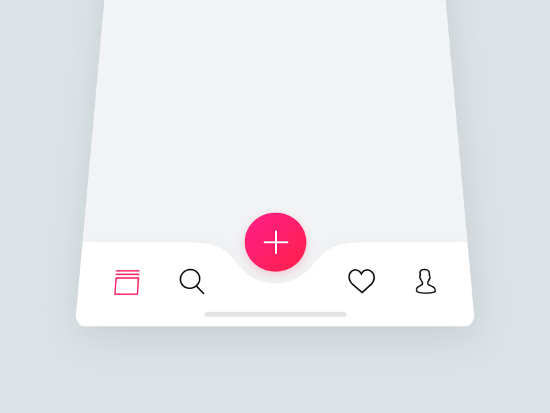
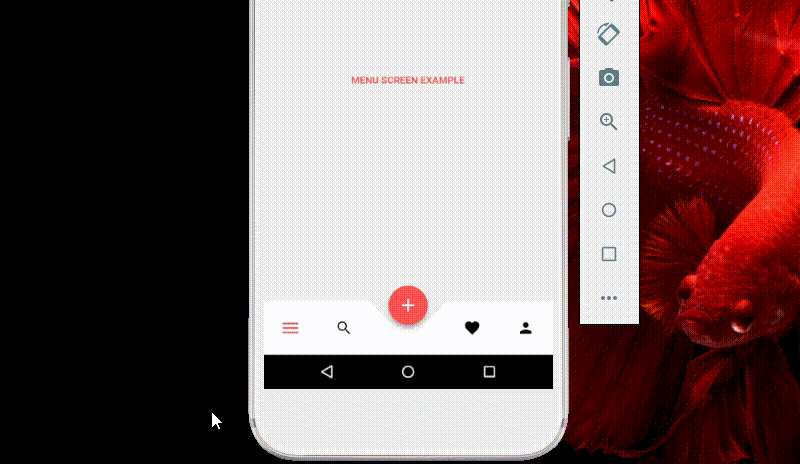

# Animated Bottom NavigationBar Flutter
Flutter component concept created with [Flutter](https://flutter.dev/) using Dart programming language, inspired by [this](https://br.pinterest.com/pin/862580134860504431/). 

## About
This component was created inspired by the GIF at the end of this page. The component is using Animations, Clip Path, Transform and Stream's proprieties to better simulate the inspiration GIF.

### The Constructor Data Fields
````dart
final Color background; //Background of buttons and navbar
final Color defaultIconColor; //Default icon color when not actived
final Color activatedIconColor; //Color of icon when actived
final Function(int i) onTapButton; //Function when button has clicked
final Function(int i) onTapButtonHidden; //Fuction when hidden button has clicked
final List<IconData> buttonsIcons; //Icons to button
final List<IconData> buttonsHiddenIcons; //Icons to hidden buttons
final Color backgroundColorMiddleIcon; //Background of middle button
````
    
### The Inspiration
The GIF below shows the inspiration component.



### The App
The GIF below shows this current component running.



#### Notes
For now, it's working with four buttons and equals hidden buttons length.
